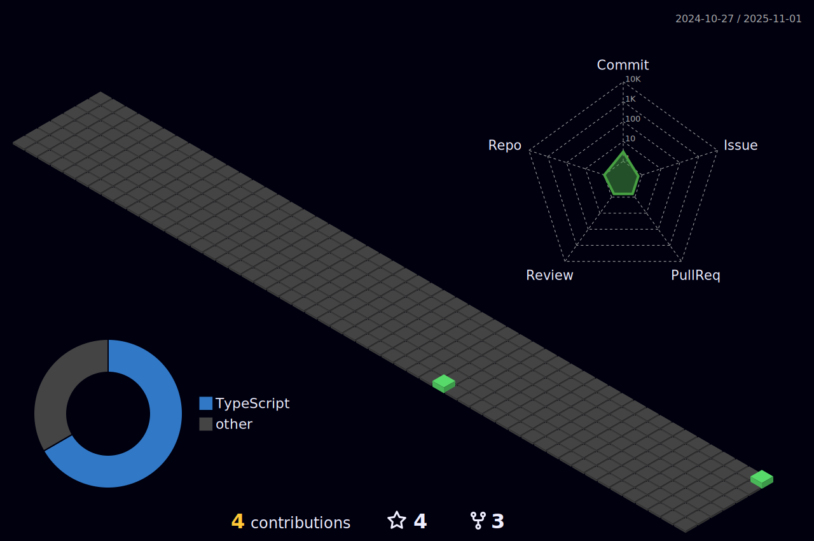

#  Make it simple, but significant

**`Learner, Developer and Cool Stuff Enthusiast`**

I’m interested in DIY, self-learning, programming and working out. To get better and learn, I try to build something everyday! This is a path that never ends. I have used Freecodecamp, The Odin Project and Scrimba to learn frontend, including React. Completed the MOOC courses for Java. Started working on Spring Boot, soon Docker and then Kubernetes. 
Reach me at: polaski.dev@gmail.com

  

### 🧰 Languages and Tools

 

### 📊 Stats

****

<!---
2Tough/2Tough is a ✨ special ✨ repository because its `README.md` (this file) appears on your GitHub profile.
You can click the Preview link to take a look at your changes.
--->
